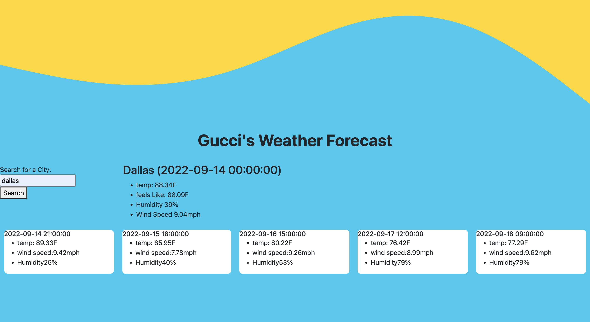

<!-- PROJECT LOGO -->
 

  

  <h3 align="center">Sunny All Day Weather Report </h3>

  

    With this weather report app it's always a sunny day! Not really, but only because it uses the latest in API technolgy to bring users the most current weather updates from ALLLLL around the world!
     

<!-- ABOUT THE PROJECT -->
## About The Project

In this project I combined my extensive(a little bit limited actually) knowledge of CSS, HTML and Javascript to make a super effective and still simple to use weather reporting application! With a click of a button you can see the weather not 1, not 2, but FIVE days into the future. You'll basically be a fortune teller to all your friends.

(<a href="#readme-top">back to top</a>)

### Built With

This page was built with HTML, CSS and Javasript.

### Prerequisites

No prerequisites required.

### Installation

This page requires no installation of any kind simply click on the link, and you are on your way to see the latest weather.

(<a href="#readme-top">back to top</a>)

<!-- USAGE EXAMPLES -->
## Usage
Weather.

(<a href="#readme-top">back to top</a>)

<!-- CONTRIBUTING -->
## Contributing

I am the only direct(instructors and tutor helped) contributer to this Repo.

(<a href="#readme-top">back to top</a>)

<!-- LICENSE -->
## License

MIT 

(<a href="#readme-top">back to top</a>)

<!-- CONTACT -->
## Contact

Fabian Gutierrez - [fabiangutierrez580@gmail.com]
(LinkedIn) - [www.linkedin.com/in/fabian-gutierrez-016523248]

Project Link: [https://guccierrez.github.io/WeatherDash/]

<!-- ACKNOWLEDGMENTS -->
## Acknowledgments
Again shout out to My instructors, Mr. Edwards and Mr. Andrew. This week I'd also like to thank my tutor Mr. Andres Jimenez.

<!-- MARKDOWN LINKS & IMAGES -->